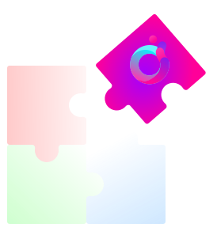

<!-- Insert logo -->

<div align="center">
    
    <h1>PMM example</h1>
</div>

## Overview

This is special example which shows how to use PMM liquidity without using SDK, only using few libraries

```ts
import {ethers, Wallet} from "ethers";
import {z} from "zod";
import hmacSHA256 from "crypto-js/hmac-sha256";
import Hex from "crypto-js/enc-hex";

///////////////////////////////
///////////////////////////////
const pmmOrderQuotationSchema = z.object({
  info: z.string().default(''),
  makerAsset: z.string().default(''),
  takerAsset: z.string().default(''),
  maker: z.string().default(''),
  allowedSender: z.string().default(''),
  makingAmount: z.string().default(''),
  takingAmount: z.string().default(''),
});

const pmmOrderSchema = z.object({
  order: pmmOrderQuotationSchema.default({}),
  signature: z.string().default(''),
  success: z.boolean().default(false),
  error: z.string().default(''),
});

const orionRFQContractABI =
        [
          {
            "inputs": [
              {
                "components": [
                  {
                    "internalType": "uint256",
                    "name": "info",
                    "type": "uint256"
                  },
                  {
                    "internalType": "address",
                    "name": "makerAsset",
                    "type": "address"
                  },
                  {
                    "internalType": "address",
                    "name": "takerAsset",
                    "type": "address"
                  },
                  {
                    "internalType": "address",
                    "name": "maker",
                    "type": "address"
                  },
                  {
                    "internalType": "address",
                    "name": "allowedSender",
                    "type": "address"
                  },
                  {
                    "internalType": "uint256",
                    "name": "makingAmount",
                    "type": "uint256"
                  },
                  {
                    "internalType": "uint256",
                    "name": "takingAmount",
                    "type": "uint256"
                  }
                ],
                "internalType": "struct OrderRFQLib.OrderRFQ",
                "name": "order",
                "type": "tuple"
              },
              {
                "internalType": "bytes",
                "name": "signature",
                "type": "bytes"
              },
              {
                "internalType": "uint256",
                "name": "flagsAndAmount",
                "type": "uint256"
              }
            ],
            "name": "fillOrderRFQ",
            "outputs": [],
            "stateMutability": "nonpayable",
            "type": "function"
          }
        ];

function encode_utf8(s : string) {
  return unescape(encodeURIComponent(s));
}
function sign(message : string, key: string) {
  return hmacSHA256(
          encode_utf8(message),
          encode_utf8(key)
  ).toString(Hex);
}

function generateHeaders(body : any, method : string, path : string, timestamp : number, apiKey : string, secretKey : string) {
  const sortedBody = Object.keys(body)
          .sort()
          .map((key) => (
                  `${key}=${body[key]}`
          )).join('&');

  const payload = timestamp + method.toUpperCase() + path + sortedBody;

  const signature = sign(payload, secretKey);

  const httpOptions = {
    headers: {
      'API-KEY': apiKey,
      'ACCESS-TIMESTAMP': timestamp.toString(),
      'ACCESS-SIGN': signature
    }
  };
  return httpOptions;
}

//
async function RFQOrder(
        tokenFrom: string,
        tokenTo: string,
        fromTokenAmount: string,
        apiKey: string, //
        secretKey: string,
        wallet: string
) : Promise<z.infer<typeof pmmOrderSchema>> {

  //  NB: replace with correct URL for networks
  const apiUrl = 'https://testing.orion.xyz/bsc-testnet/backend'
          //      const apiUrl = 'https://trade.orion.xyz/bsc-mainnet/backend'
          , path = '/rfq'
          , url = `${apiUrl}/api/v1/integration/pmm`+path
          , headers = {
            'Content-Type': 'application/json',
          }
          , data = {
            "baseToken":tokenFrom, // USDT
            "quoteToken":tokenTo, // ORN
            "amount": fromTokenAmount, // 100
            "taker": wallet,
            "feeBps": 0
          }
          , method = 'POST'
          , timestamp = Date.now()
          , signatureHeaders = generateHeaders(data, method, path, timestamp, apiKey, secretKey)
          , compiledHeaders = {...headers, ...signatureHeaders.headers, }
          , body = JSON.stringify(data)
  ;

  let res  = pmmOrderSchema.parse({});

  try {
    const result = await fetch(url,{
      headers: compiledHeaders,
      method,
      body
    });

    //  const data = await result.text();
    //  console.log(data);

    const json = await result.json();
    console.log(json);
    const parseResult = pmmOrderSchema.safeParse(json);

    if(!parseResult.success) {
      //  Try to parse error answer
      const errorSchema = z.object({error: z.object({code: z.number(), reason: z.string()})});

      const errorParseResult = errorSchema.safeParse(json);

      if(!errorParseResult.success)
        throw Error(`Unrecognized answer from aggregator: ${json}`);

      throw Error(errorParseResult.data.error.reason);
    }

    res.order = parseResult.data.order;
    res.signature = parseResult.data.signature;
    res.error = '';
    res.success = true;
  }
  catch(err) {
    res.error = `${err}`;
  }
  return res;
}


(async() => {
  const apiKey = '958153f1-b8b9-3ec4-84eb-2147429105d9';
  const secretKey = 'secretKey';

  //  BNB testnet tokens and router
  const assetORN = '0xf223eca06261145b3287a0fefd8cfad371c7eb34';
  const assetUSDT = '0xcb2951e90d8dcf16e1fa84ac0c83f48906d6a744';
  const router = '0x89357522C0ed6E557D39dC75290859246077bdfC';

  //  BNB mainnet tokens and router
  //  const assetORN = '0xe4ca1f75eca6214393fce1c1b316c237664eaa8e';
  //  const assetUSDT = '0x55d398326f99059ff775485246999027b3197955';
  //  const router = '0xcb2D40EabC4f4c92Ee993Eb3D67f7717bE476E76';

  const rfqOrder = await RFQOrder(
          assetORN,   //  Spending asset
          assetUSDT,  //  Receiving asset
          '1000000000',        //  Amount in "satoshi" of spending asset
          apiKey,
          secretKey,
          '0x61Eed69c0d112C690fD6f44bB621357B89fBE67F'  //  Can be any address, ignored for now
  );

  if(!rfqOrder.success) {
    console.log(rfqOrder.error);
    return;
  }

  //  ... here you can check order prices, etc.
  console.log(rfqOrder);

  //  Calldata according to provided rfqOrder
  const contractInterface = new ethers.Interface(orionRFQContractABI);
  const calldata = contractInterface.encodeFunctionData("fillOrderRFQ", [rfqOrder.order, rfqOrder.signature, 0]);
  console.log('Calldata = ', calldata);

  //  Call router with this data
  //  Replace with your private key
  const yourWalletPrivateKey = '0xf1.......';

  const tx = {
    to: router,
    data: calldata
  }

  const provider = new ethers.JsonRpcProvider("https://data-seed-prebsc-1-s1.binance.org:8545/");
  const signer = new ethers.Wallet(yourWalletPrivateKey, provider);
  console.log('Address = ', signer.address);
  const transactionResponse = await signer.sendTransaction(tx);
  console.log("Transaction hash:", transactionResponse.hash);
  await transactionResponse.wait();
})();
```